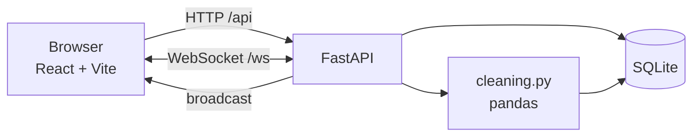

# RM Student Data Pipeline & UI

Upload a raw student CSV, clean it automatically, set a minimum total score, and export the shortlist. Debarring a student removes them from the shortlist for every connected client immediately, over a WebSocket, with no re-upload.

Built for the CDIE Recruitment Manager Portal technical assessment.


**Live demo:** <https://rm-project.onrender.com>
_(hosted on Render's free tier — the first request after a period of inactivity may take ~50 seconds to wake the service)_

PASSWORDS - ADMIN ( USERNAME : ADMIN , PASSWORD :ADMIN ) , STUDENT ( USERNAME : STUDENT , PASSWORD : STUDENT)
---

## Video demonstration

**▶ [Watch the 90-second demo](https://drive.google.com/file/d/1cIH-m_z7CukO28jBt2_ACvhom59HIL-P/view?usp=sharing)**

Covers: uploading the raw file, the cleaning report, dragging the score threshold, exporting the shortlist, and two browsers staying in sync as a student is debarred.

---

## Quick start

Requires Python 3.11+ and Node 18+.

```bash
git clone https://github.com/Himani2506/rm-project.git
cd rm-project

pip install -r requirements.txt
cd frontend && npm install && npm run build && cd ..

uvicorn backend.main:app --port 8000
```

Open <http://localhost:8000>. Sign in as `admin` / `admin`, then upload `data/sample_raw.csv`.

<details>
<summary>Development mode (hot reload)</summary>

Two terminals. FastAPI on 8000, Vite on 5173 proxying `/api` and `/ws` to it:

```bash
uvicorn backend.main:app --reload --port 8000     # terminal 1
cd frontend && npm run dev                        # terminal 2
```

Open <http://localhost:5173>.
</details>

```bash
make test     # 84 tests
make bench    # pipeline timings at 1k / 10k / 100k rows
```

Interactive API docs are generated at `/docs`.

---

## Architecture

One deployable service. FastAPI serves the API *and* the compiled frontend, so there is a single origin: no CORS in production, and WebSockets share the page's scheme and host.



```
backend/
  cleaning.py   pure pandas — no framework imports, independently testable
  db.py         SQLite; the single source of truth for student state
  main.py       routes, static host, WebSocket endpoint
  ws.py         connection manager / broadcast
  auth.py       password hashing, token issue and verification, role gates
  models.py     pydantic request bodies
frontend/src/   React; Histogram.jsx is hand-rolled SVG, no chart dependency
tests/          45 pipeline tests + 39 API tests
scripts/        benchmark harness
```

Scores are stored in three generic slots rather than columns named after specific subjects, with the human-readable label for each slot held in a `meta` table and returned with every response. That is what lets the same schema hold `Math / Science / English` for one file and `G1 / G2 / G3` for another.

**Why SQLite rather than in-memory state.** REST reads, WebSocket broadcasts and CSV exports all query the same tables, so they cannot drift apart. Debar status also survives a page reload and is shared across clients, which an in-process dictionary would not give you.

---

## How the cleaning works

`clean_dataframe()` in `backend/cleaning.py`. Order matters — each stage assumes the previous one has run.

**1 · Column mapping.** The pipeline does not hard-code the assessment file's column names. It resolves a *mapping* from roles — name, gender, grade, score columns, stated total — onto whichever columns the file actually has.

Header aliases are tried first (`Student Name`, `Sex`, `Maths`, `Eng` all resolve). Where a role has no alias match, the guess falls back to the data: a name column is textual and mostly distinct, a score column parses as a number in range and genuinely varies. Among equally plausible score candidates the rightmost win, since score columns conventionally sit at the end of a record.

Only one thing is actually required: **at least one numeric column to score on.** Everything else degrades. No name column means students are numbered `Student 0001…`; no gender column means every row reads `Unknown`; no grade column means imputation falls back to the cohort median.

If nothing scoreable is found, the upload is **not** rejected. The server replies with the columns it found, a five-row preview and its best guess, and the UI opens a mapping panel so the admin can choose. The guess is also correctable at any time via *Change columns*, because an automatic guess that cannot be overridden is worse than no guess.

**2 · Name formatting.** Strips wrapping double quotes, trailing apostrophes and stray punctuation, collapses whitespace, applies title case. `"Aarav"`, `Navya'` and `ROHAN` all normalise. 72 of the 99 supplied rows needed this.

**3 · Name typos — Levenshtein against a data-derived vocabulary.** Names occurring twice or more are treated as canonical. Each singleton is compared to that vocabulary and corrected if the edit distance is 2 or less, ties broken by frequency. On the supplied dataset this fires exactly once: `Isha` → `Ishaan`.

The vocabulary is derived from the file rather than hard-coded, so the stage degrades safely on a cohort with different names, and does nothing at all if every name is unique. Distance is computed with an early-exit implementation that abandons a comparison once it exceeds the threshold.

*This is a judgement call and the app shows it as one.* `Isha` is also a real standalone name. Every correction is logged with its before and after and surfaced in the "What was changed" panel, so a coordinator can see the merge happened rather than discovering it in an export.

**4 · Gender.** Eight text spellings (`M`, `m`, `Male`, `male`, and the female equivalents) map to `Male` / `Female`. The supplied file also contains `0` and `1` — seven of each. **These are mapped to `Unknown`, not guessed.** There is no key in the dataset and the split is exactly even, so any mapping would be invention. Gender does not affect shortlisting, so the ambiguity costs nothing; fabricating a value could.

**5 · Grade.** Digits extracted, so `11` and `Grade 11` converge. Values outside 1–12 are cleared and logged.

**6 · Scores.** Non-numeric text stripped, so `28 marks` becomes `28`. 67 of the 99 supplied rows had at least one contaminated cell. Values outside 0–100 are rejected as unusable rather than clamped — a mark of 150 is a data error, and silently turning it into 100 would change who gets shortlisted.

**7 · Imputation, deliberately conservative.** A row missing exactly **one** score gets the median for its grade level, and is tagged `imputed` in the UI. A row missing **two or more** is quarantined instead. Imputing enough of a score to change a shortlisting outcome is fabricating a candidate's results. When a file has only one score column, imputation is disabled entirely — there is nothing to infer from.

**8 · Total is always recomputed.** The uploaded `Total` is never trusted; it is parsed only to compare against the sum. Disagreements are logged as `total_mismatch` and the recomputed value wins, because the subject marks are the source of truth. (The supplied file happens to be arithmetically consistent in all 99 rows — the stage is exercised by `tests/fixtures/dirty.csv`.)

**9 · Quarantine.** Rows with an unusable mark or no name are retained and displayed, flagged, and **excluded from the shortlist and from all statistics**. They are downloadable as `quarantined-rows.csv`. Bad rows are never silently dropped.

**10 · Deduplication.** The key is `(name, grade, and every score)` — deliberately including the marks. Names repeat heavily in this dataset (79 of 99 rows share a first name with another row) because distinct students share common first names. **Deduplicating on name alone would destroy roughly 80% of the cohort**, and it would compound with the fuzzy matching in step 3. A `UNIQUE` constraint on the same tuple backs this up at the database level.

Every stage appends to a structured log that the UI renders grouped by category with expandable examples. A pipeline that reports what it changed is auditable; one that returns clean data silently is indistinguishable from one that did nothing.

### On the supplied dataset

| | |
|---|---|
| Rows in / retained | 99 / 99 |
| Name formatting normalised | 72 |
| Name typos corrected | 1 (`Isha` → `Ishaan`) |
| Gender values standardised | 61 |
| Gender left as `Unknown` | 14 |
| Grade formats parsed | 38 |
| Marks stripped of `" marks"` | 95 cells across 67 rows |
| Duplicates removed | 0 |
| Total mismatches | 0 |
| Quarantined | 0 |

The supplied file contains no duplicates, no missing values and no incorrect totals. Those stages are covered by `tests/fixtures/dirty.csv`, a hand-built file with three duplicate rows, a planted typo, two rows missing one mark, one missing two, four wrong totals, a mark of 150, a mark of −5, an invalid grade and a nameless row.

---

## Features

**Admin**
- Upload CSV, TSV, or Excel — delimiter sniffed, UTF-8/BOM/Latin-1 handled
- Real sign-in: hashed passwords, signed sessions, ticketed WebSockets
- Column mapping panel for files that don't match the expected schema, with per-column diagnostics (percentage numeric, distinct count, sample values)
- Cleaning report grouped by category, with before/after examples per change
- Threshold slider and numeric input, debounced, with a live score histogram
- Per-row Active/Debarred toggle, optimistic with rollback and an undo toast
- Multi-select for bulk debar and reinstate
- Export the filtered shortlist, and separately export quarantined rows
- Recent activity feed backed by an audit table
- Live client count from the WebSocket connection set

**Student** — read-only shortlist. The server strips administrative fields and quarantined rows from the payload; this is enforced in the route, not hidden in the UI.

### The histogram

The score distribution with the cutoff drawn through it: bars above the threshold fill in, bars below drain to grey as the slider moves. Choosing a cutoff is the actual decision this tool exists to support, and a coordinator wants to see how much of the cohort each choice admits. Hand-rolled SVG — no chart library, so nothing to install and nothing to break on upgrade.

---

## Real-time updates

A single in-process pub/sub topic. Every client subscribes on load; a status change broadcasts the changed record together with recomputed statistics, so clients patch local state rather than refetching the table — a broadcast that triggers a refetch is just polling with extra steps.

```
PATCH /api/students/12/status  ──▶  SQLite write + audit row
                                ──▶  broadcast { student, stats }
                                ──▶  every client patches its row
```

The client reconnects with capped backoff if the socket drops, and shows the connection state in the header.

For a single instance this is the right amount of machinery. Horizontal scaling would need an external broker (Redis pub/sub) so that broadcasts reach clients attached to other workers.

---

## Performance

`python scripts/benchmark.py` generates synthetic data with the same defect profile as the supplied file, plus injected duplicates and missing values.

| Rows | Clean | DB insert | Filter query | Stats query |
|---:|---:|---:|---:|---:|
| 1,000 | 46 ms | 16 ms | 4.4 ms | 1.6 ms |
| 10,000 | 225 ms | 76 ms | 35.9 ms | 8.0 ms |
| 100,000 | 2,091 ms | 1,264 ms | 605 ms | 127 ms |

The supplied 99-row dataset cleans in **~36 ms** end to end, and shortlist queries run in **under 1 ms**. (The filter timing includes serialising every matching row; the indexed count behind the statistics is the millisecond figure in the last column.)

Three things carry this:

- **Cleaning runs once, at upload.** Every subsequent filter is a SQL query, not a pandas pass. The composite index `(status, quarantined, total)` covers the shortlist predicate exactly.
- **Bulk insert is vectorised.** Building plain Python columns and zipping them, rather than iterating the DataFrame row-wise, made the 100k insert 5.5× faster (7.4 s → 1.3 s).
- **The slider is debounced at 150 ms** and the WebSocket patches single rows, so dragging the threshold does not refetch the table on every frame.

Measured timings are surfaced in the UI — `query N ms` under the statistics, `cleaned in N ms` after upload — so latency is visible rather than claimed.

---

## API

| Method | Route | Role | |
|---|---|---|---|
| POST | `/api/login` | — | returns a signed bearer token |
| POST | `/api/ws-ticket` | any | short-lived ticket for the socket upgrade |
| POST | `/api/inspect` | admin | describe a file without committing it |
| POST | `/api/upload` | admin | multipart file, optional `mapping` → cleaning report |
| GET | `/api/students` | any | `min_total`, `shortlist_only`, `search` |
| GET | `/api/stats` | any | counts, averages, histogram buckets |
| GET | `/api/health` | — | liveness probe; returns no cohort data |
| GET | `/api/cleaning-log` | admin | latest run's change log |
| GET | `/api/audit` | admin | status-change history |
| PATCH | `/api/students/{id}/status` | admin | broadcasts |
| PATCH | `/api/students/status` | admin | bulk; broadcasts |
| GET | `/api/export` | admin | shortlist CSV |
| GET | `/api/export/rejects` | admin | quarantined rows CSV |
| WS | `/ws` | ticket | `status_changed`, `bulk_status_changed`, `dataset_replaced`, `presence` |

### Authentication and roles

Two roles, `admin` and `student`. Authorisation is enforced by a FastAPI
dependency on every protected route, and read routes shape their response by
role: a student never receives quarantined rows or administrative fields.

**Passwords** are stored as PBKDF2-HMAC-SHA256 hashes at 200,000 rounds with a
per-user random salt. Nothing is kept in plaintext. Login compares in constant
time and hashes against a dummy salt when the username does not exist, so a
missing account and a wrong password take the same time and return the same
message — the endpoint does not reveal which usernames are real.

**Sessions** are HMAC-SHA256 signed bearer tokens carrying the subject, role
and an expiry, valid for eight hours. The signature is verified with a
constant-time comparison on every request. The client cannot assert its own
role: the role is read from inside the signed token, so editing it invalidates
the signature.

**WebSockets** are gated too. A browser cannot attach an `Authorization` header
to a socket upgrade, so the client exchanges its session token for a
sixty-second, single-purpose ticket and passes that in the query string. A
session token presented as a ticket is rejected, and vice versa — the two have
different `purpose` claims.

Built on `hashlib`, `hmac` and `secrets` from the standard library, so there is
no extra dependency to install on the host.

Set `RM_SECRET_KEY`, `RM_ADMIN_PASSWORD`, `RM_STUDENT_PASSWORD` and
`RM_ENV=production` in the environment on a real deployment. Without `RM_SECRET_KEY` a random key is
generated at startup, which invalidates existing sessions on restart rather
than falling back to a guessable default.

Ten tests cover this directly, including a forged token with a valid signature
but altered claims, an expired token, a student token on admin routes,
malformed `Authorization` headers, an unticketed socket, and a session token
reused as a socket ticket.

**Found and fixed in a pre-submission security review:** `/api/stats` was
reachable without credentials and exposed cohort size, score averages, the
distribution histogram and debarment counts; bulk status changes accepted an
unbounded list of ids; CORS was registered in production where it is not
needed. Each now has a regression test. The review also confirmed that query
parameters are validated (out-of-range values return 422), that all SQL is
parameterised, and that upload errors do not leak stack traces or filesystem
paths.

**A deliberate disclosure decision:** an authenticated student can see the
whole shortlist, including other students' marks. That is the product — a
published shortlist is public within the cohort — but it is a choice, not an
oversight. Restricting a student to their own row would mean linking accounts
to student records, which this dataset has no key for.

**What is still missing for production:** login rate limiting, token
revocation (there is no server-side session store, so a stolen token is valid
until it expires), refresh tokens, and credentials in a users table rather than
environment variables.

## Deployment

The repository includes `render.yaml`. Point Render at the repo and it builds the frontend and starts uvicorn as one web service.

Environment variables: `RM_SECRET_KEY` (session signing), `RM_ADMIN_PASSWORD`
and `RM_STUDENT_PASSWORD` (credentials), `RM_ENV=production` (disables the
development CORS allowance), `RM_DB_PATH` (SQLite location).

Two things worth knowing on a free tier:

- The service sleeps after inactivity; the first request wakes it in roughly 50 seconds.
- The filesystem is ephemeral, so `RM_DB_PATH` points at `/tmp` and uploaded data resets on restart. That is correct for a demo — for real use, mount a persistent disk or point at Postgres.

---

## Testing

```
tests/test_cleaning.py   45 tests — parsing, typo correction, imputation,
                                    quarantine, dedup, ingestion robustness,
                                    column detection on two unrelated schemas,
                                    explicit mappings, plus assertions against
                                    the supplied file
tests/test_api.py        39 tests — RBAC on every protected route, threshold
                                    counts, debar→shortlist exclusion, export
                                    row counts and headers, bulk actions, audit
                                    trail, WebSocket broadcast, inspect
                                    endpoint, mapping prompt and rejection,
                                    plus hardening regressions (traversal,
                                    upload cap, response cap, row cap, CSV
                                    formula injection)
```

The API tests assert exact shortlist counts at four thresholds against the supplied dataset (80 / 52 / 15 / 3 at ≥100 / 150 / 200 / 250), so a regression in the cleaning pipeline fails the suite rather than quietly changing who gets selected.

---

## Notes and limitations

- `data/sample_raw.csv` is the supplied assessment dataset, included so the app can be run end to end without hunting for a file.
- Imputation uses a grade-level median. With a small cohort in a given grade this is a weak estimate; the row is flagged in the UI so the value is never mistaken for a reported mark.
- The pipeline holds the full file in memory. Beyond a few hundred thousand rows it would need chunked reads.
- A maximum of three score columns is supported, matching the assessment schema. A file with more numeric columns is still accepted — the admin chooses which three to score on.
- Automatic column detection is a heuristic and will sometimes guess wrong on an unfamiliar file. That is why the guess is always visible and always overridable, rather than silent.
- `Unknown` gender is a deliberate dead end, not a gap — see step 4.
